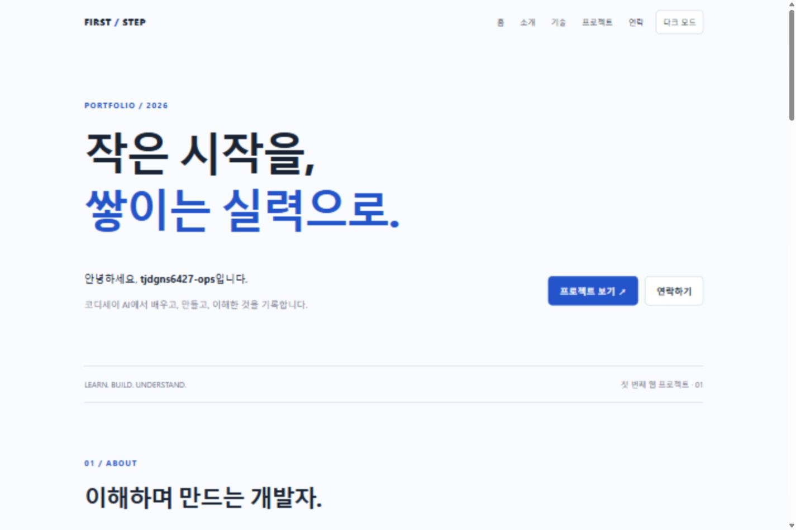
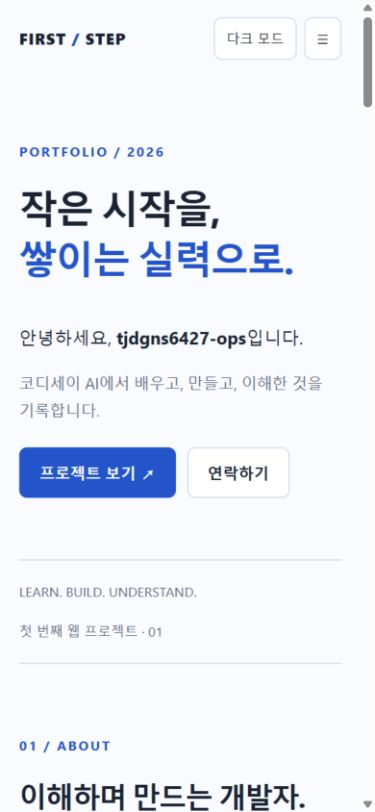
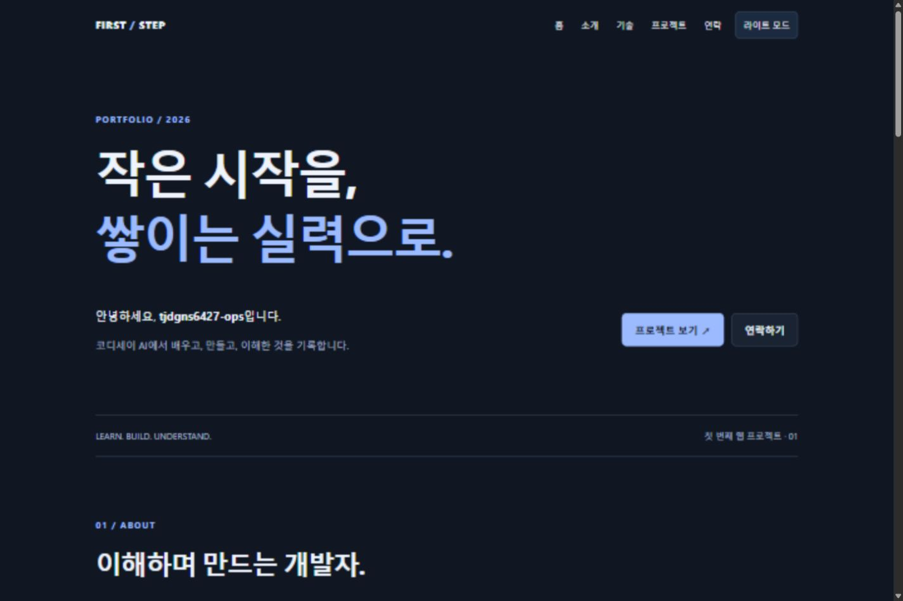

# 첫 번째 포트폴리오 — mission-B1-1

코디세이 AI에서 개발을 배우며 만든 반응형 포트폴리오입니다. 외부 라이브러리 없이 HTML, CSS, JavaScript로 구현했습니다.

## 현재 상태

- GitHub 계정: [tjdgns6427-ops](https://github.com/tjdgns6427-ops)
- 로컬 구현 및 주요 브라우저 동작 검증 완료
- 배포 대상: 새 저장소 `mission-B1-1` (기존 미션 저장소와 분리)
- **저장소 URL / GitHub Pages 배포 URL: 아직 미발급. GitHub 로그인 후 추가 예정**
- 아래 스크린샷은 로컬 실행 화면입니다.

## 실행

1. VS Code에서 이 폴더를 엽니다.
2. 공식 확장 `Live Server` (Ritwick Dey)를 설치합니다. 작업 컴퓨터에는 설치 완료했습니다.
3. `index.html`을 우클릭 → **Open with Live Server**.
4. `http://127.0.0.1:5500`에서 확인합니다. 이미 같은 포트의 미리보기 서버가 켜져 있다면 종료하거나 Live Server 포트를 변경합니다.

별도의 빌드나 패키지 설치는 필요하지 않습니다.

## 파일 역할

```text
index.html              시맨틱 구조, 섹션, 문의 폼
css/style.css           모바일 우선 레이아웃, 테마, 애니메이션
js/config.js            표시 이름, GitHub 아이디
js/main.js              이벤트, 상태, DOM 렌더링, API 호출
images/profile.svg      첫 걸음을 표현한 프로필 이미지
images/desktop.png      데스크톱 화면
images/mobile.png       모바일 화면
images/dark.png         다크 모드 화면
LEARNING.md             코드 이해와 예상 질문 답변
CHECKLIST.md            요구사항별 구현 및 검증 기록
.vscode/                Live Server 추천 및 포트 설정
.nojekyll               정적 파일 그대로 배포
```

## 구현 기능과 기준값

- Hero, About, Skills, Projects, Contact, Footer
- 모바일 우선 CSS, 768px / 1024px 미디어 쿼리
- 내비게이션 Flexbox, 프로젝트 카드 Grid (`auto-fit`, `minmax`)
- 모바일 메뉴 토글, 메뉴 선택 및 Escape로 닫기
- 앵커와 CSS `scroll-behavior`를 통한 부드러운 스크롤
- **스크롤 60px 이상**: 내비게이션 배경색 변경
- **스크롤 300px 이상**: 맨 위로 버튼 표시
- `IntersectionObserver` **threshold 0.2**: 화면에 들어온 요소 표시
- 다크 모드: `data-theme`, CSS 변수, `localStorage` 저장
- 이름/이메일/메시지 필수 검사, 이메일 형식 검사, 필드별 오류, 성공 안내
- GitHub 공개 저장소 로딩·성공·오류·빈 목록 처리와 재시도
- 외부 문자열 HTML 이스케이프, 안전한 GitHub 링크, 키보드 포커스 표시
- 움직임 감소 설정(`prefers-reduced-motion`) 존중

## 상태 → 화면 흐름

| 사건 | 상태 변경 | 화면 반영 |
|---|---|---|
| 테마 버튼 클릭 | `state.theme` | `renderTheme()` → `data-theme`, 버튼 문구 |
| 메뉴 버튼 클릭 | `state.menuOpen` | `renderMenu()` → `.active`, `aria-expanded` |
| 페이지 시작 / 재시도 | `state.projects` | `renderProjects()` → 로딩/카드/오류/빈 상태 |
| 입력 / 제출 | `state.form` | `renderForm()` → 오류 문구/성공 안내 |

## API

`https://api.github.com/users/{아이디}/repos?sort=updated&per_page=100&page=1`

`fetch`, `async/await`, `try/catch`를 사용합니다. `response.ok`를 검사하여 HTTP 오류도 처리합니다. `Link` 응답 헤더에 다음 페이지가 있으면 이어서 읽습니다. 15초를 넘기면 요청을 취소하고 재시도를 안내합니다. 403/429 응답은 요청 제한 안내를 표시합니다. 설명이나 언어가 없는 저장소에는 대체 문구를 표시합니다.

로그인 토큰을 코드에 넣지 않습니다. 인증 없는 GitHub REST API는 기본적으로 IP당 시간당 60회 제한이 있으므로 반복 새로고침을 피합니다.

## 문의 폼의 범위

실제 이메일을 보내지 않는 학습용 폼입니다. 성공 메시지는 입력 검증 성공을 뜻합니다. `preventDefault()`로 페이지 이동을 막고, 공백만 입력한 값도 거부합니다. 입력 내용은 서버나 로컬스토리지에 저장하지 않습니다.

## GitHub Pages 배포

1. 선택한 GitHub 저장소에 이 폴더 **안의 파일**을 올립니다. 저장소 최상위에 `index.html`이 있어야 합니다.
2. 저장소 **Settings → Pages → Build and deployment**에서 **Deploy from a branch**를 선택합니다.
3. 업로드한 브랜치(예: `main`), **/(root)**를 선택하고 Save를 누릅니다.
4. 배포 완료 후 제공된 URL에 접속하여 다시 검증합니다.
5. 실제 저장소 URL과 실제 배포 URL을 이 README 상단에 기록합니다.

모든 로컬 리소스는 상대 경로를 사용하므로 `사용자.github.io/저장소/` 형태에서도 동작합니다.

## 스크린샷

### 데스크톱


### 모바일


### 다크 모드


## 참고

- [GitHub 저장소 API 공식 문서](https://docs.github.com/en/rest/repos/repos#list-repositories-for-a-user)
- [GitHub Pages 배포 소스 설정](https://docs.github.com/en/pages/getting-started-with-github-pages/configuring-a-publishing-source-for-your-github-pages-site)
- [GitHub REST API 요청 제한](https://docs.github.com/en/rest/using-the-rest-api/rate-limits-for-the-rest-api)
